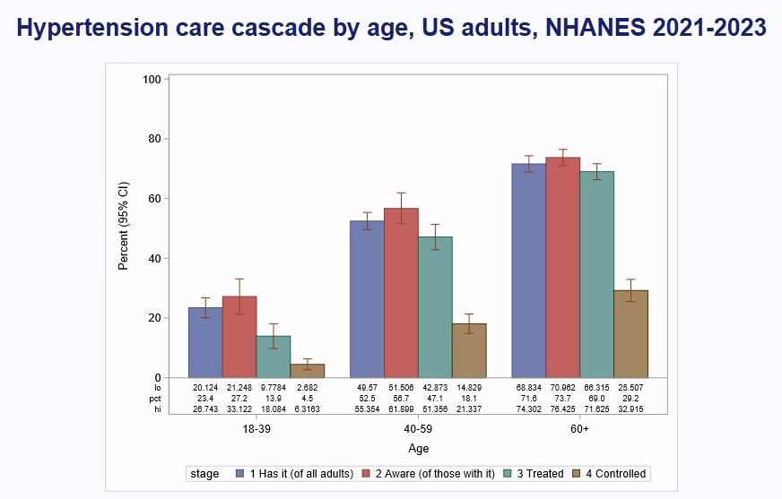
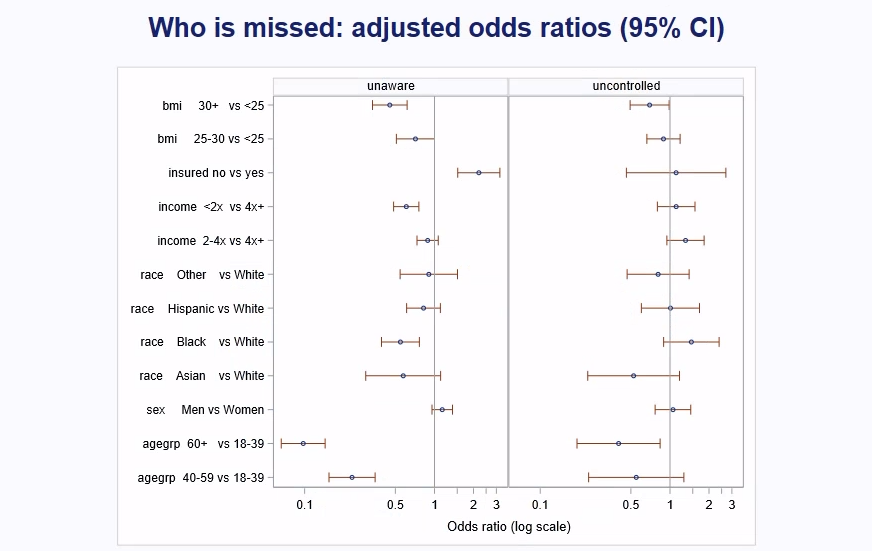

# Hypertension in US adults: who is being missed? (SAS, NHANES 2021–2023)

Almost half of US adults have high blood pressure, but only about one in five of them has it under control. This
project does two things in SAS:

1. It reproduces CDC's own figures (NCHS Data Brief No. 511) from the raw survey files, using the full survey design.
2. It asks who falls out of the care cascade, with two survey logistic models: who is **unaware** they have
   hypertension, and who is still **uncontrolled** while taking medication.

Build log: https://mrrishit909.github.io/projects/nhanes-sas/

## Data

NHANES August 2021 – August 2023 (CDC/NCHS), five public files: demographics (`DEMO_L`), oscillometric blood pressure
(`BPXO_L`), the blood-pressure questionnaire (`BPQ_L`), body measures (`BMX_L`) and health insurance (`HIQ_L`).
The SAS program downloads them itself with `PROC HTTP`; nothing raw is committed. There are 11,933 people in 15 strata
and 30 PSUs. 6,084 of them are adults with a valid blood-pressure reading who are not pregnant (the brief's sample).

## How it was run

`sas/01_hypertension.sas` ran in **SAS Enterprise Guide (SAS 9.4M9, Windows)** on USF's virtual desktop. Enterprise
Guide pulled the program from this repository at a pinned commit:

```sas
options source2; filename p url "https://raw.githubusercontent.com/mrrishit909/nhanes-sas/<commit>/sas/01_hypertension.sas"; %include p;
```

The full log is `sas/01_hypertension.log` (0 errors, 0 warnings; the Windows user name in temporary paths is replaced
by `<user>`). Every result is also written to the log as a `CSV|` line. `parse_log.py` turns those lines into
`results/estimates.csv`, `results/ageadj.csv` and `results/odds.csv`.

```
./venv/bin/python parse_log.py sas/01_hypertension.log
./venv/bin/python check.py
```

## Steps

1. **Read and merge** the five transport files by `SEQN`. Systolic and diastolic pressure are each the mean of up to
   three readings. Hypertension follows the brief's definition: 130/80 mm Hg or more, or currently taking medication.
2. **Domains, not subsets.** Everyone stays in the analysis file. Subgroups such as adults, people with hypertension,
   or men aged 40–59 are `DOMAIN` statements. Cutting the file first would give the wrong standard errors.
3. **`PROC SURVEYMEANS`** with `STRATA`, `CLUSTER` and `WEIGHT` (Taylor linearisation) estimates prevalence,
   awareness, treatment and control by sex and age. Prevalence is then age-adjusted to the 2000 US population by
   direct standardisation.
4. **`PROC SURVEYLOGISTIC`** fits the two "who is missed" models: age, sex, race and Hispanic origin, income (as a
   multiple of the poverty line), insurance and BMI. The survey has only 15 design degrees of freedom
   (30 PSUs − 15 strata), so the models keep 12 parameters and leave unknown values out instead of modelling them.
5. **`PROC SGPLOT` / `SGPANEL`** draw the charts below (screenshots of Enterprise Guide's results).
6. **`check.py`** recomputes every SAS number in Python. It uses the same files and the same Taylor-linearised
   variance with PSUs within strata.

## Results

**CDC's figures, reproduced.**

| | All adults | Men | Women | 18–39 | 40–59 | 60+ |
|---|---|---|---|---|---|---|
| Has hypertension | 47.7% | 50.8% | 44.6% | 23.4% | 52.5% | 71.6% |
| … of those: aware | 59.2% | 55.2% | 63.6% | 27.2% | 56.7% | 73.7% |
| … taking medication | 51.2% | 46.7% | 56.1% | 13.9% | 47.1% | 69.0% (CDC 69.1%) |
| … controlled (<130/80) | 20.7% | 18.9% | 22.8% | 4.5% | 18.1% | 29.2% |

The age-adjusted prevalence is 44.5% overall, 48.8% for men and 40.1% for women, the same as the brief.

**How close it is.** 23 of the 24 published figures match to one decimal, and so do all 3 age-adjusted rates. The
one that doesn't is treatment at age 60+: 68.97% here, 69.1% in the brief. Dropping people who did not answer the
medication questions moves it to 69.05%, but it also moves overall control from 20.75% to 20.8%. No single rule
matches all 24 at one decimal, so the plain definition is kept and the gap is reported.



**Who is unaware** (2,797 adults with hypertension and complete predictors; 1,014 unaware). Odds ratios (95% CI):

- **Uninsured: 2.20 (1.51–3.19).** This is the clearest gap. People without insurance are about twice as likely not
  to know.
- Age 60+ vs 18–39: 0.10 (0.07–0.14), and 40–59: 0.23 (0.15–0.35). Young adults are the least likely to know.
- Obese (BMI 30+) vs under 25: 0.45 (0.33–0.62). People with obesity are more likely to have been told, perhaps
  because they are checked more often.
- Black vs White: 0.55 (0.39–0.76). Income under 2× the poverty line vs 4×+: 0.61 (0.48–0.76).
- Sex: 1.15 (0.96–1.38), not significant.

**Who is uncontrolled while on treatment** (1,575 treated adults; 921 uncontrolled): only age clearly matters.
Age 60+ vs 18–39 is 0.40 (0.19–0.84). Obesity is at the edge: 0.70 (0.49–0.99). Insurance, income and race have wide
intervals that include 1.



## What this does not show

- It is one survey at one point in time. The odds ratios are associations, not causes.
- "Unaware" means a person's readings on one exam day were high and they had never been told. A doctor would
  diagnose only after repeated high readings, so some young "unaware" cases may not have lasting hypertension.
- Medication use is self-reported.
- The models are limited to 12 parameters by the 15 design degrees of freedom, so there are no interactions and no
  finer categories.
- The charts are screenshots of SAS output in Enterprise Guide; no image files were exported from the session.
